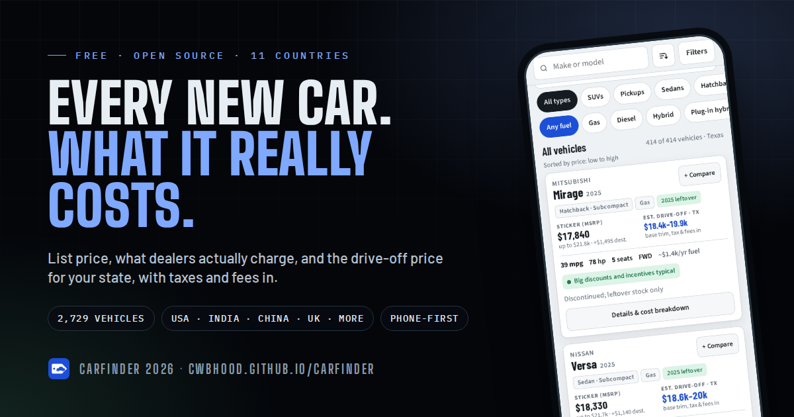
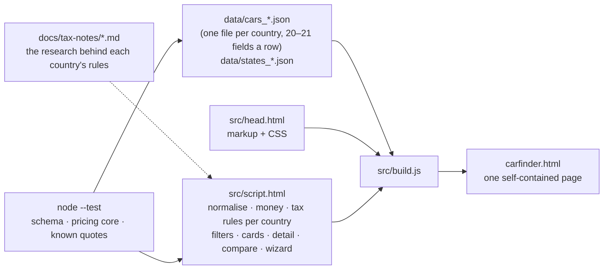

# CarFinder 2026

**Every new car and truck on sale, and what it really costs.** The list price, what dealers actually charge for that
model right now, and the drive-off price for your state or city once taxes and fees are added, for 2,729 vehicles across
the USA, India, China, the UK, Australia, Mexico, Spain, Thailand, Russia, Brazil and Canada. It runs in your browser
(phones too), with no install, no account, no ads and no tracking.

**▶ [Website](https://cwbhood.github.io/carfinder/) · [Open CarFinder](https://cwbhood.github.io/carfinder/carfinder.html) · [How to use it](https://cwbhood.github.io/carfinder/#how) · [About the creator](https://cwbhood.github.io/carfinder/about.html)**

## What you can do
- **See three prices, not one.** Every card shows the maker's price from base to top trim, the band dealers really sell
  that model in this month (at sticker, a little under, or deep discounts), and the estimated total with tax, title and
  fees for the place you live.
- **Pick your state or city.** 50 US states, 20+ Indian states, 8 Chinese cities, Australian states, Mexican estados,
  Spanish regions, Russian regions, Brazilian states and Canadian provinces, each with its own sales tax, road tax,
  plates, insurance, levies and rebates. Everything recomputes when you change it.
- **Filter like a buyer.** Body type, fuel, price range, size, brand tier, seats, drivetrain, minimum MPG, minimum
  electric range, brand, model year. Or answer four questions ("Help me choose") and let it set the filters for you.
- **Open a window sticker.** Drag the trim slider from base to fully loaded and watch every line of the cost breakdown
  move: destination, discount, tax, doc fee, registration, insurance, grants, with a note on what each is and whether
  it is negotiable. Plus the estimated monthly payment and yearly fuel or charging cost, with editable assumptions.
- **Compare four side by side.** Price, drive-off, monthly, efficiency, power, seats, drivetrain and market notes.
- **MPG and miles for everyone.** Every figure outside the US carries its US-unit twin (17.4 kmpl / 41 mpg, 543 km /
  337 mi, 53 mpg UK / 44 mpg US). The World tab lets you pick mpg, L/100 km or km/L outright.
- **A World tab.** All 2,729 cars converted to one currency at ECB rates, with a country filter and a
  cheapest-per-horsepower sort.
- **Plain English.** Each country has a glossary (MSRP, OTR, ex-showroom, RTO, 落地价, tenencia, IPVA, ОСАГО…) and a
  "How these numbers work" note that says exactly what is estimated and how.

## How it's built

- **One file, no framework.** Markup, CSS and plain JavaScript with the data inlined, so the page works from a
  `file://` URL and keeps working offline once loaded. The only build step is a 60-line Node script that stitches the
  parts together. Fonts are self-hosted (SIL OFL); the page makes no third-party requests.
- **Data as JSON, rules as functions.** Each country's cars are one JSON file with a documented row schema
  ([docs/DATA.md](docs/DATA.md)). Each country's taxes and fees are one function (`bdUS`, `bdIN`, `bdCN`…) that returns
  the breakdown lines, so a wrong rate is a one-line fix.
- **Phone-first.** One sticky row (search, sort, filters), bottom-sheet filters and dialogs, 44 px controls, 16 px
  inputs, light and dark themes, tested from 360 px up.

## Accuracy
Dealer prices are **bands by demand level**, not quotes: at or above sticker for waiting-list models, a few percent off
for most, 10–35% off where a model is being cleared (the band and the reason are on every card). Taxes and fees follow
the published rules on the compile date, **29 September 2026**; exchange rates are the ECB reference rates of that day.
The tests assert known real-world quotes (a RAV4 in Texas, a Creta in Maharashtra, a RAV4 in Ontario, a Sandero in the
UK, a Seagull in China) and run the pricing core for all 44,000 car-and-region combinations. Treat every number as a
range to bargain within and get the out-the-door price in writing from two or three dealers.

## Run it
- **Online:** use the links above.
- **Locally:** clone, then `python3 -m http.server` (or any static server) and open http://localhost:8000/. Opening
  `carfinder.html` straight from disk works too.
- **After editing `src/` or `data/`:** `node src/build.js` rebuilds `carfinder.html`; commit both.
- **Tests:** `node --test` (schema checks, pricing core, known quotes, build in sync). Browser checks (every tab and
  control at phone and desktop widths) need Python with Playwright: `pip install playwright pillow && playwright
  install chromium`, then `python3 test/browser/audit.py` and `python3 test/browser/interact.py`.
- **For a claude.ai artifact:** `node src/build.js --artifact` writes `dist/carfinder-artifact.html`, a bare fragment
  that uses Google Fonts (the artifact wrapper supplies the document skeleton).

| Path | What |
|---|---|
| `carfinder.html` | the app, built; `index.html` and `about.html` are the website |
| `src/` | `head.html` (markup + CSS), `script.html` (all code), `build.js` |
| `data/` | `cars_<cc>.json` per country, `states_us.json`, `states_in.json` |
| `docs/` | [data schema](docs/DATA.md), [architecture](docs/ARCHITECTURE.md), [testing](docs/TESTING.md), [tax research notes](docs/tax-notes/) per country |
| `test/` | Node tests (`*.test.mjs`) and the Playwright browser checks (`browser/`) |
| `brand/` | emblem, screenshots, social card, fonts, the portrait, and `tools/` to regenerate them |

## Contributing
Found a wrong price, a missing model or an out-of-date tax rule? Open an issue with a source, or edit the JSON row (the
schema is in [docs/DATA.md](docs/DATA.md)), run `node src/build.js && node --test`, and send a pull request. New
countries are welcome too: see [CONTRIBUTING.md](CONTRIBUTING.md) for the adapter pattern (a config block, a money
formatter, a region table and one breakdown function).

## Credit and licence
CarFinder is by [Destin Jones](https://cwbhood.github.io/carfinder/about.html) ([GitHub](https://github.com/cwbhood)),
vibe coded in public with Claude as the building partner. Also by me:
[Open Overwatch](https://cwbhood.github.io/open-overwatch/), a live map of the whole planet, and
[Ironbound](https://cwbhood.github.io/godot-open-rts/), a free open source RTS made with Godot.

The code and data are MIT licensed ([LICENSE](LICENSE)): use it, fork it, build on it, and keep the copyright line.
Vehicle prices and specifications belong to their manufacturers and are compiled here for reference. The fonts are
under the SIL Open Font License ([brand/fonts/](brand/fonts/)).
If you write about it or build on it, please credit it: *Jones, D. (2026). CarFinder 2026 [Computer software].
https://github.com/cwbhood/carfinder* (GitHub's "Cite this repository" button reads [CITATION.cff](CITATION.cff)).
